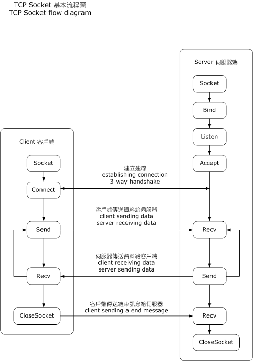

**Author**: Martin Ombura Jr.

**Date**: May 21, 2019

# How Golang Connections are Made at a Kernel Level — Golang net pkg #2

In [Part 1](../1-sockets-the-genesis-of-golang-connections-1/article.md) of this series we introduced the idea of sockets, what they were,
common syscall APIs to creating and binding addresses to them. In this article
we introduce the other 3 core socket API methods and we visualize the connection
process between interconnected systems using the knowledge we gained.

## 1. The Connect, Listen and Accept Socket API Calls
In order to fully visualize how connections are set up, we need to introduce
three new socket API calls that will be of importance as we continue this
article series. These are `connect()`, `accept()` and `listen()`

```c
// Code Snippet 1: Connect() API Call
#include <sys/types.h>
#include <sys/socket.h>

int connect(int sockfd, const struct sockaddr *addr, socklen_t addrlen);
```

Connect is responsible for connecting a client with a server that is listening. The clients socket is referenced in the first argument sockfd and it connects to the servers bound address specified in the 2nd argument sockaddr. This is different from `bind()` as we saw in the previous article, that takes a socket and attaches a local address to it making it available from within the machine, whereas `connect()` has the ability to attach the address to a remote address that may want to use that socket to communicate. In most cases `bind()` would be used by a server to make its socket known, and `connect()` would be used by a `client()` to connect to the server. The 3rd argument is the addrlen that is simply used to specify the size of the addr _(2nd argument)_. If a `connect()` fails, it is good practice for the client to close the socket and attempt a new connection with a new socket.

### 2.2 Accept
```c
// Code Snippet 2: Accept() API Call

#include <sys/types.h>          /* See NOTES */
#include <sys/socket.h>

int accept(int sockfd, struct sockaddr *addr, socklen_t *addrlen);
```

Accept is used to take an incoming connection on the listening socket indicated
by its socket file descriptor `sockfd` , it then creates a new socket and
returns the new file descriptor for new connections to read/write to. The
original socket that called `listen()` always remains open and can be used to
accept further connections. If there are no other connections, the call blocks
until new connections arrive.

### 2.3 Listen
```c
// Code Snippet 3: Listen() API Call

#include <sys/types.h>          /* See NOTES */
#include <sys/socket.h>

int listen(int sockfd, int backlog);
```

Listen takes in the socket file descriptor `sockfd`, and marks that a socket as a
passive socket and is ready to accept incoming connections. Passive sockets
differ from active sockets in that when you create a socket with the `socket()`
command as shown in the previous article, these default to being active. This
active socket (client) can be used in a `connect()` call to create a connection to
a passive socket (server). The kernel can proceed to schedule other work as the
socket waits on a connection. The `backlog` argument defines a maximum queue
length of pending connections. If the number is exceeded the client can receive
a connection refused error.

Note: `listen()` cannot be re-applied to a connected socket that had a
successful `connect()` call from a client, or a socket returned by a call to
`accept()`

## 3. A Visualization of the Connection Process

Now that we know the other pieces of the puzzle we can now visualize the
connection process between client and server. We shall use a connection-oriented
protocol like TCP `(SOCK_STREAM)` In _Figure 1_ below we have two entities, a
client and server. Each entity contains a info-box with the calls its makes in
order to establish a usable connection-oriented transaction.



**Figure 1:** Photo from [Bekeley Sockets](https://en.wikipedia.org/wiki/Berkeley_sockets)

1. Server Socket Creation and Binding: A server starts of by calling `socket()` to create a socket. This socket acts as an endpoint for communication and returns a file descriptor for the socket.
2. Binding the Socket to an address: The server then calls `bind()` to bind a well-known address which must be supplied to the socket. If not, the socket can not accept connections from any remote host. If `bind()` is not called, the kernel may apply a random host port to to make the socket available from localhost only.
3. Server Calls Listen: The `listen()` is invoked by the server to allow it to begin accepting connections. It moves the socket from an active to passive state. At this point a client can initiate a connection.
4. Client Creates a Socket: A client must create a socket to allow a connection to perform read/write operationson that socket. A SOCK_STREAM socket type enables a bidirectional streaming. When, the client chooses to create the socket is not as important as when the client decides to call `connect()` to the servers address.
5. Server Calls Accept: Once the server calls `accept()`, the server blocks until there is a connection from a client. In a multi-threaded environment, the thread will block until the server is terminated prematurely or a connection from a client is created.
6. Client Calls Connect: The client is free to call `connect()` at this point, passing in the servers address. The server is available and ready to accept connections as it is in the passive state ready to `accept()` connections. When the server responds it will use the address of the client that’s stored in a network header (usually IP header). If the client calls `connect()` before the server calls `accept()` but after the server calls `listen()`, the connect would be added to the listeners backlog, if the backlog limit has been reached, the connection will be refused.
7. Client Write and Server Read: The client and server can begin to write to to the connection as if writing to a file. This abstraction of reading and writing to a connection as if it were a file is crucial to understanding low-level IO, and it will spring up quite often in subsequent articles. For now it is important to know the client sends a request by writing to the connection, the server reads the written data stream, and responds with another write to the connection. We shall look at the intricacies of reading and writing in a later article, but for now, keep in mind writing to a connection is inherently the same as writing to a file. The term file to the designers of unix tends to have a more abstract meaning than that of the way we use day to day.
Connection Termination: A connection can be terminated for several reasons,
either client or server terminating the connection, higher-level timeouts on
connections being sent, extraneous errors, connections on the `listen()` backlog
overflowing etc.

This back and forth on a connection-oriented protocol may remind you of an image
you may have seen when learning TCP. That is because I have just described the
TCP connection flow to you using unix based syscalls, instead of SYN, ACKs etc
_(See Figure 2)_.

<p align="center">
  
</p>

[//]: <()>

This is what happens under the hood when Go initiates connection-oriented client-server interactions. In the next article we begin to explore the idea of file descriptors a bit more and how connections have striking similarities to files.